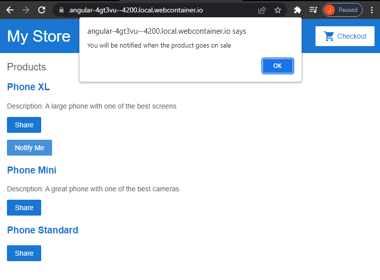
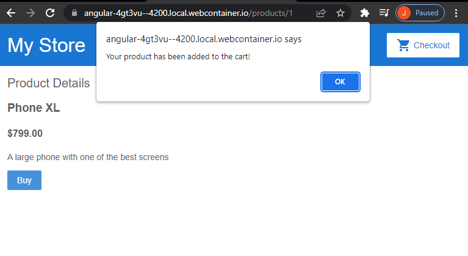
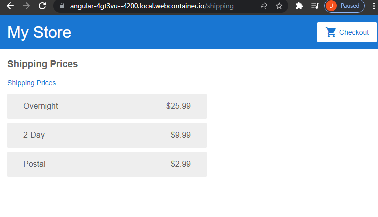
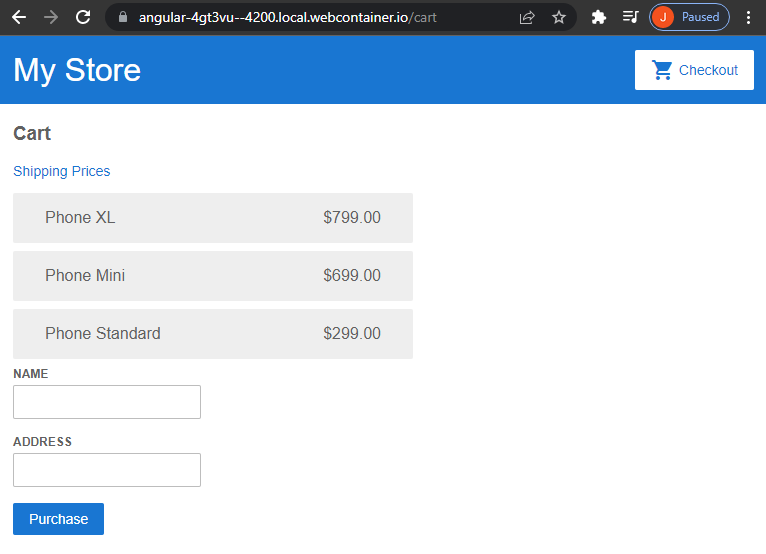

https://angular.io/start

Shape the DOM structure with product lists, details, cart info, shipping info, and a form.  Pass data from child to parent components.  Associate URLs with new generated components.  Request data from external sources.  Import convenient angular services.  Use the CLI to make the app locally accessible and ready for online hosting services.

